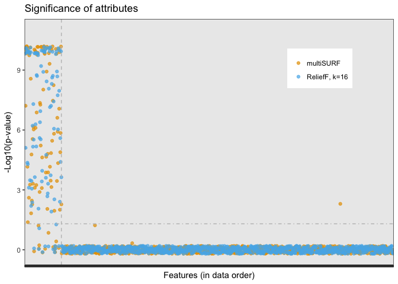

STIR (STatistical Inference Relief) Example
================
Brett McKinney and Trang Le
2018-07-12

Install STIR and privateEC:
---------------------------

``` r
knitr::opts_chunk$set(echo = TRUE, warning=FALSE)
rm(list = ls())

if (!("devtools" %in% installed.packages()[,"Package"])){
  install.packages("devtools", repos = "http://cran.us.r-project.org", dependencies = TRUE)
}
library(devtools)

if (!("privateEC" %in% installed.packages()[,"Package"])){
  devtools::install_github("insilico/privateEC", build_vignettes = TRUE)
}
if (!("stir" %in% installed.packages()[,"Package"])){
  devtools::install_github("insilico/stir", build_vignettes = TRUE)
}
library(privateEC)  # used to simulate data
library(stir)

# load other helper packages
packages <- c("ggplot2", "CORElearn", "reshape2", "dplyr", "pROC", "plotROC")
check.packages(packages)  # helper function from STIR
```

Simulate data with privateEC
----------------------------

``` r
letsSimulate <- T   # F to use previously simulated data
class.lab <- "class"
writeData <- letsSimulate  # usually the same
writeResults <- T

num.samp <- 100
num.attr <- 1000
pct.signals <- 0.1
bias <- 0.4
#sim.type <- "mainEffect"
sim.type <- "interactionErdos"

pec_simFile <- paste("pec_simulated", sim.type, "bias", bias, 
                             "pct.signals", pct.signals,
                             "num.attr", num.attr, "num.samp", num.samp, sep = "_")
pec_simFile <- paste(pec_simFile,".csv",sep="")

if (letsSimulate == TRUE){
    sim.data <- createSimulation(num.samples = num.samp, num.variables = num.attr,
                                 pct.signals = pct.signals, pct.train = 1/2, pct.holdout = 1/2, 
                                 bias = bias, sim.type = sim.type, verbose = FALSE)
  dat <- rbind(sim.data$train, sim.data$holdout)
  predictors.mat <- dat[, - which(colnames(dat) == class.lab)]
} else { # optional: use provided data
  dat <- read.csv(pec_simFile)
  dat <- dat[,-1] # written file has first X column with subject names
  predictors.mat <- dat[, - which(colnames(dat) == class.lab)]
}

dat[, class.lab] <- as.factor(dat[, class.lab]) 
pheno.class <- dat[, class.lab]
attr.names <- colnames(predictors.mat)
num.samp <- nrow(dat)

if (writeData == TRUE){
  write.csv(dat, file = pec_simFile)
}
```

### Run STIR-multiSURF:

``` r
RF.method = "multisurf"
metric <- "manhattan"
# let k=0 because multisurf does not use k
neighbor.idx.observed <- find.neighbors(predictors.mat, pheno.class, k = 0, method = RF.method)
results.list <- stir(predictors.mat, neighbor.idx.observed, k = k, metric = metric, method = RF.method)
t_sorted_multisurf <- results.list$`STIR-t`[, -3]  # remove cohen-d
colnames(t_sorted_multisurf) <- paste(c("t.stat", "t.pval", "t.pval.adj"), "stir", sep=".")
(t_sorted_multisurf[1:10,])
```

    ##          t.stat.stir  t.pval.stir t.pval.adj.stir
    ## simvar63   11.844177 3.827384e-32    3.827384e-29
    ## simvar1    11.810575 5.635538e-32    5.629902e-29
    ## simvar55   11.241182 3.399137e-29    3.392339e-26
    ## simvar14   10.769340 5.483913e-27    5.467461e-24
    ## simvar20   10.642974 2.067472e-26    2.059202e-23
    ## simvar34   10.315815 6.000613e-25    5.970610e-22
    ## simvar32   10.231040 1.413502e-24    1.405021e-21
    ## simvar98   10.073603 6.819262e-24    6.771527e-21
    ## simvar56    9.964957 1.993471e-23    1.977523e-20
    ## simvar85    9.827012 7.661615e-23    7.592661e-20

``` r
t_sorted_multisurf$attribute <- rownames(t_sorted_multisurf) # adds a column for merge
```

### Run STIR-ReliefF constant *k* = ⌊(*m* − 1)/6⌋:

ReliefF with *k* = ⌊(*m* − 1)/6⌋ (where m is the number of samples) is similar to multiSURF:

``` r
t_sorted_relieff <- list()
i <- 0
RF.method = "relieff"
k <- floor(num.samp/6)  # k=m/6 should be similar to MultiSURF
i <- i+1  # if you want to use k for loop
neighbor.idx.observed <- find.neighbors(predictors.mat, pheno.class, k = k, method = RF.method)
results.list <- stir(predictors.mat, neighbor.idx.observed, k = k, metric = metric, method = RF.method)
t_sorted_relieff[[i]] <- results.list$`STIR-t`[, -3]
colnames(t_sorted_relieff[[i]]) <- paste(c("t.stat", "t.pval", "t.pval.adj"), k, sep=".")
(t_sorted_relieff[[i]][1:10,])
```

    ##          t.stat.16    t.pval.16 t.pval.adj.16
    ## simvar1  11.977493 1.136481e-32  1.136481e-29
    ## simvar63 11.178031 8.746913e-29  8.738166e-26
    ## simvar55 10.371823 4.102019e-25  4.093815e-22
    ## simvar56 10.223259 1.828220e-24  1.822735e-21
    ## simvar34 10.150724 3.765207e-24  3.750146e-21
    ## simvar14 10.149205 3.822400e-24  3.803288e-21
    ## simvar20 10.016505 1.415628e-23  1.407134e-20
    ## simvar85  9.801441 1.142475e-22  1.134478e-19
    ## simvar32  9.724861 2.379014e-22  2.359982e-19
    ## simvar5   9.601221 7.688314e-22  7.619119e-19

``` r
t_sorted_relieff[[i]]$attribute <- rownames(t_sorted_relieff[[i]])
t_sorted_relieff[[i+1]] <- t_sorted_multisurf
```

### Standard t-test:

``` r
sort.pvalue <- function(pvalue.vec){
  # sort attributes based on pvalues, important attributes on top
  sort(pvalue.vec, decreasing = FALSE)
}
regular.ttest.results <- sapply(1:ncol(predictors.mat), regular.ttest.fn, dat = dat)
names(regular.ttest.results) <- colnames(predictors.mat)
regular.ttest.sorted <- sort.pvalue(regular.ttest.results)
regular.t.padj <- data.frame(regT.padj = p.adjust(regular.ttest.sorted))
```

### Aggregate results of STIR with ReleifF and STIR with MultiSURF and regular t-test:

``` r
final.mat <- Reduce(function(x, y) merge(x, y, by = "attribute", sort = F), t_sorted_relieff)
#final.mat <- reshape::merge_all(t_sorted_relieff)

# Are the columns sorted separately? There is only one column of attribute names 
# View(final.mat[1:15,],"Resutls: First 15 Rows")  # View has a problem with Rmarkdown

if (writeResults == T){
write.csv(final.mat,file="final.mat.csv")
}
```

Plot STIR significance of attributes:
-------------------------------------

``` r
rownames(final.mat) <- final.mat$attribute
pval.df <- final.mat[attr.names, ]

pval.melt <- melt(pval.df[, c("attribute", "t.pval.adj.stir", "t.pval.adj.16")], id.vars = 1)
levels(pval.melt$variable) <- c("multiSURF", "ReliefF, k=16")
pval.melt$value <- -log(pval.melt$value, 10)
pval.melt$value[pval.melt$value >10] <- 10

cbPalette <- c("#999999", "#E69F00", "#56B4E9", "#009E73", "#F0E442", "#0072B2", "#D55E00", "#CC79A7")
t4 <- ggplot(pval.melt, aes(x = attribute, y = value, group = variable, color = variable)) + 
  ylim(c(-0.2,11))+
  geom_point(alpha = 0.7, position = position_jitter(w = 0, h = 0.2)) + 
  geom_vline(xintercept = 100, linetype = 2, color = "grey") + 
  labs(y = "-Log10(p-value)", x = "Features (in data order)", title = "Significance of attributes") + 
  theme_bw() +
  theme(legend.position = c(0.8, 0.8), legend.title = element_blank(), axis.text.x=element_blank()) + 
  scale_color_manual(values = cbPalette[2:3]) +
  geom_hline(yintercept = -log(0.05, 10), linetype = 4, color = "grey") 
```

Plot of -log10(p-values) of attributes. Attributes are in their original order from the data, but the significant attributes tend to be on the left because the simulated functional attributes were targeted to be first. Thus, attributes to the left of the vertical dashed line are targeted as *functional* or *predictive* in the simulation. However, for interactions, some attributes on the right may be functional due to network co-expression. (Note: p-values less than *e*<sup>−10</sup> are plotted as *e*<sup>−10</sup> for scaling. Points are slightly jittered vertically to show results of both methods.)

``` r
show(t4)
```


